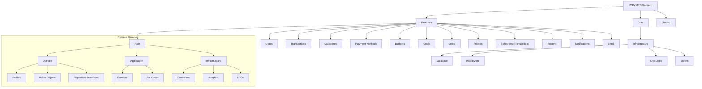
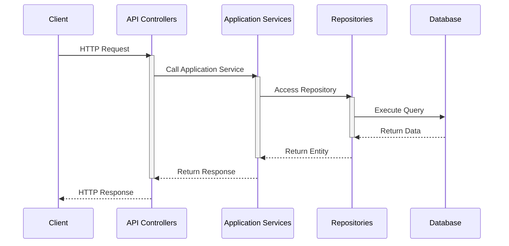
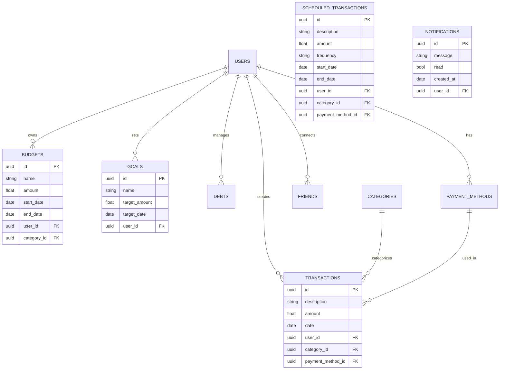
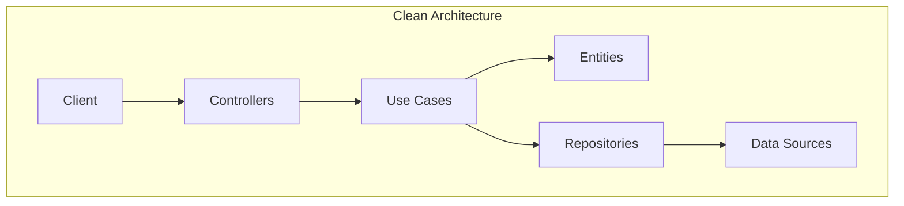

# FOPYWAY Backend Architecture

## Project Structure

```mermaid
graph TD
    A[FOPYMES Backend] --> B[Core]
    A --> C[Features]
    A --> D[Shared]
    
    B --> B1[Infrastructure]
    B1 --> B11[Database]
    B1 --> B12[Middleware]
    B1 --> B13[Cron Jobs]
    B1 --> B14[Scripts]
    
    C --> C1[Auth]
    C --> C2[Users]
    C --> C3[Transactions]
    C --> C4[Categories]
    C --> C5[Payment Methods]
    C --> C6[Budgets]
    C --> C7[Goals]
    C --> C8[Debts]
    C --> C9[Friends]
    C --> C10[Scheduled Transactions]
    C --> C11[Reports]
    C --> C12[Notifications]
    C --> C13[Email]
    
    subgraph Feature Structure
        C1 --> C1A[Domain]
        C1 --> C1B[Application]
        C1 --> C1C[Infrastructure]
        
        C1A --> C1A1[Entities]
        C1A --> C1A2[Value Objects]
        C1A --> C1A3[Repository Interfaces]
        
        C1B --> C1B1[Services]
        C1B --> C1B2[Use Cases]
        
        C1C --> C1C1[Controllers]
        C1C --> C1C2[Adapters]
        C1C --> C1C3[DTOs]
    end
```

## Application Flow

```mermaid
sequenceDiagram
    participant Client
    participant API as API Controllers
    participant Service as Application Services
    participant Repository as Repositories
    participant Database
    
    Client->>API: HTTP Request
    activate API
    API->>Service: Call Application Service
    activate Service
    Service->>Repository: Access Repository
    activate Repository
    Repository->>Database: Execute Query
    Database-->>Repository: Return Data
    deactivate Repository
    Repository-->>Service: Return Entity
    deactivate Service
    Service-->>API: Return Response
    deactivate API
    API-->>Client: HTTP Response
```

## Database Schema

```mermaid
erDiagram
    USERS ||--o{ TRANSACTIONS : creates
    USERS ||--o{ BUDGETS : owns
    USERS ||--o{ GOALS : sets
    USERS ||--o{ DEBTS : manages
    USERS ||--o{ PAYMENT_METHODS : has
    USERS ||--o{ FRIENDS : connects
    
    CATEGORIES ||--o{ TRANSACTIONS : categorizes
    PAYMENT_METHODS ||--o{ TRANSACTIONS : used_in
    
    TRANSACTIONS {
        uuid id PK
        string description
        float amount
        date date
        uuid user_id FK
        uuid category_id FK
        uuid payment_method_id FK
    }
    
    BUDGETS {
        uuid id PK
        string name
        float amount
        date start_date
        date end_date
        uuid user_id FK
        uuid category_id FK
    }
    
    GOALS {
        uuid id PK
        string name
        float target_amount
        date target_date
        uuid user_id FK
    }
    
    SCHEDULED_TRANSACTIONS {
        uuid id PK
        string description
        float amount
        string frequency
        date start_date
        date end_date
        uuid user_id FK
        uuid category_id FK
        uuid payment_method_id FK
    }
    
    NOTIFICATIONS {
        uuid id PK
        string message
        bool read
        date created_at
        uuid user_id FK
    }
```

## Architecture Pattern

```mermaid
graph TD
    subgraph "Clean Architecture"
        A[Client] --> B[Controllers]
        B --> C[Use Cases]
        C --> D[Entities]
        C --> E[Repositories]
        E --> F[Data Sources]
    end
``` 
