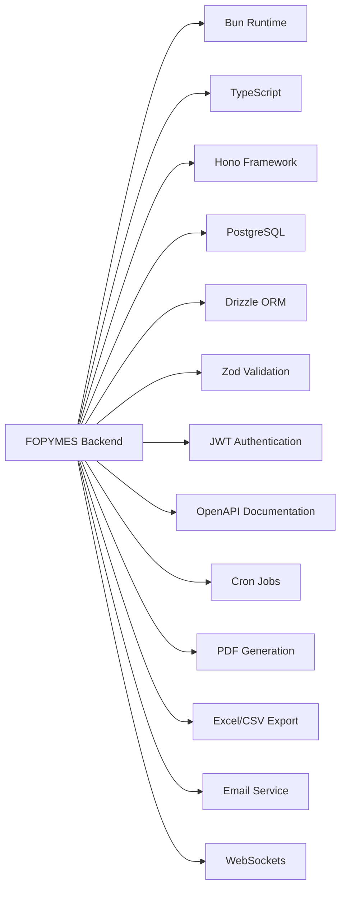
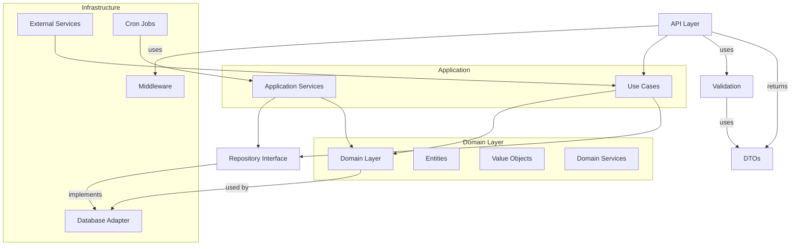
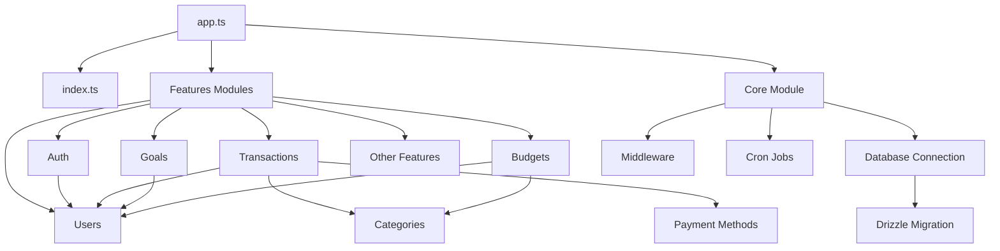
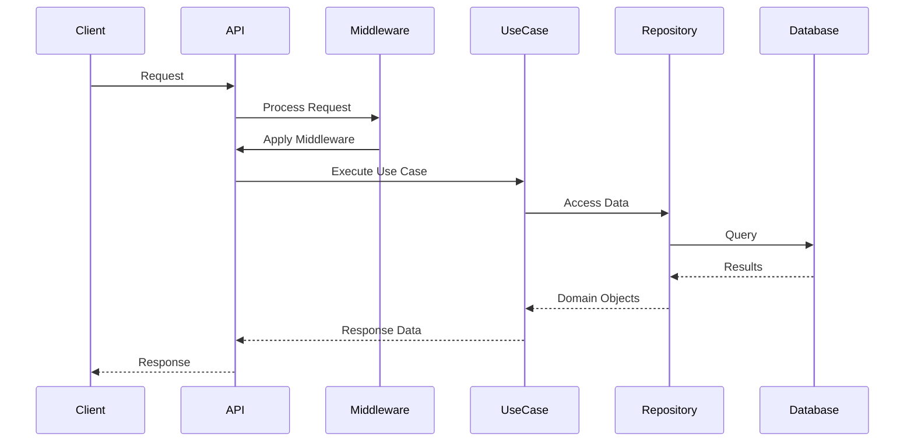
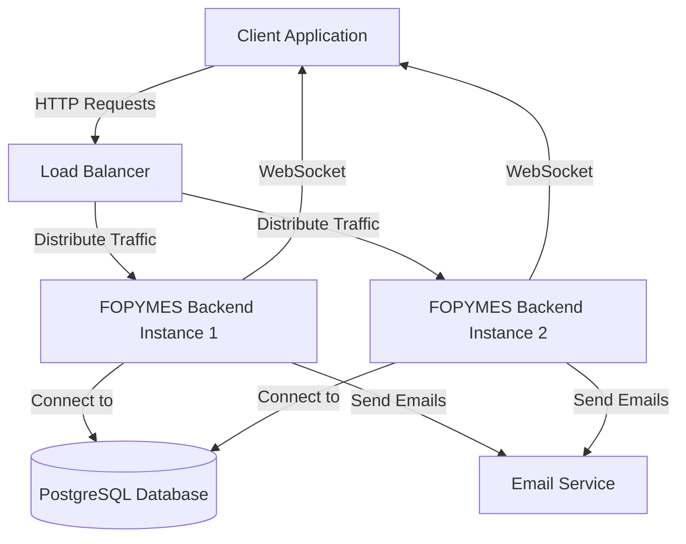

# FOPYMES Backend Technical Architecture

## Technology Stack

```mermaid
graph LR
    A[FOPYMES Backend] --> B[Bun Runtime]
    A --> C[TypeScript]
    A --> D[Hono Framework]
    A --> E[PostgreSQL]
    A --> F[Drizzle ORM]
    A --> G[Zod Validation]
    A --> H[JWT Authentication]
    A --> I[OpenAPI Documentation]
    A --> J[Cron Jobs]
    A --> K[PDF Generation]
    A --> L[Excel/CSV Export]
    A --> M[Email Service]
    A --> N[WebSockets]
```

## Dependency Flow

```mermaid
flowchart TD
    API[API Layer] --> UseCase[Use Cases]
    UseCase --> Domain[Domain Layer]
    UseCase --> Repository[Repository Interface]
    Repository --> |implements| DatabaseAdapter[Database Adapter]
    Domain --> |used by| DatabaseAdapter
    API --> |uses| Middleware[Middleware]
    API --> |uses| Validation[Validation]
    Validation --> |uses| DTOs[DTOs]
    API --> |returns| DTOs
    
    subgraph Infrastructure
        DatabaseAdapter
        ExternalServices[External Services]
        Middleware
        Cron[Cron Jobs]
    end
    
    subgraph Application
        UseCase
        Services[Application Services]
    end
    
    subgraph Domain Layer
        Domain
        Entities[Entities]
        ValueObjects[Value Objects]
        DomainServices[Domain Services]
    end
    
    Services --> Repository
    Services --> Domain
    Cron --> Services
    ExternalServices --> UseCase
```

## Module Dependencies

```mermaid
graph TD
    App[app.ts] --> Index[index.ts]
    App --> Features[Features Modules]
    App --> Core[Core Module]
    
    Features --> Auth[Auth]
    Features --> Users[Users]
    Features --> Transactions[Transactions]
    Features --> Goals[Goals]
    Features --> Budgets[Budgets]
    Features --> Others[Other Features]
    
    Auth --> Users
    Transactions --> Users
    Transactions --> Categories[Categories]
    Transactions --> PaymentMethods[Payment Methods]
    Goals --> Users
    Budgets --> Users
    Budgets --> Categories
    
    Core --> Database[Database Connection]
    Core --> Middleware[Middleware]
    Core --> Cron[Cron Jobs]
    
    Database --> Migration[Drizzle Migration]
```

## Data Flow

```mermaid
sequenceDiagram
    participant Client
    participant API
    participant Middleware
    participant UseCase
    participant Repository
    participant Database
    
    Client->>API: Request
    API->>Middleware: Process Request
    Middleware->>API: Apply Middleware
    API->>UseCase: Execute Use Case
    UseCase->>Repository: Access Data
    Repository->>Database: Query
    Database-->>Repository: Results
    Repository-->>UseCase: Domain Objects
    UseCase-->>API: Response Data
    API-->>Client: Response
```

## Deployment Architecture

```mermaid
graph TD
    Client[Client Application] -->|HTTP Requests| LB[Load Balancer]
    LB -->|Distribute Traffic| Server1[FOPYMES Backend Instance 1]
    LB -->|Distribute Traffic| Server2[FOPYMES Backend Instance 2]
    Server1 -->|Connect to| DB[(PostgreSQL Database)]
    Server2 -->|Connect to| DB
    Server1 -->|Send Emails| EmailService[Email Service]
    Server2 -->|Send Emails| EmailService
    Server1 -->|WebSocket| Client
    Server2 -->|WebSocket| Client
``` 